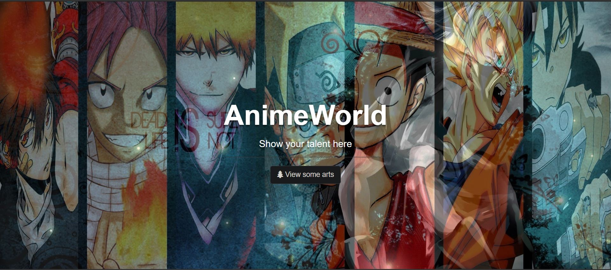
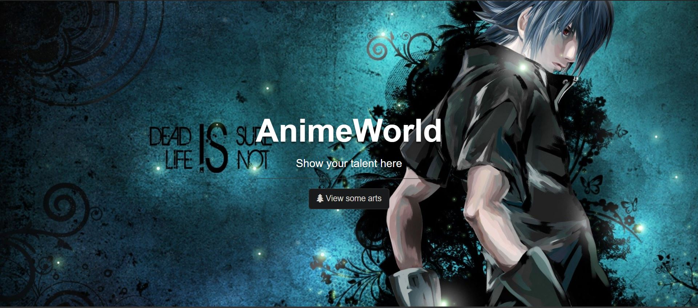
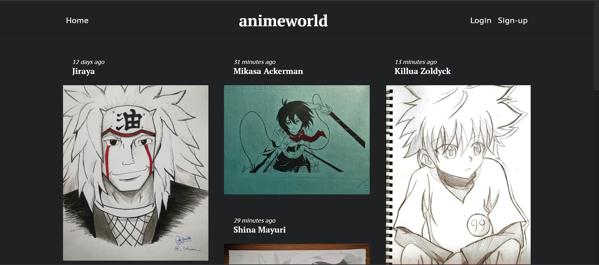
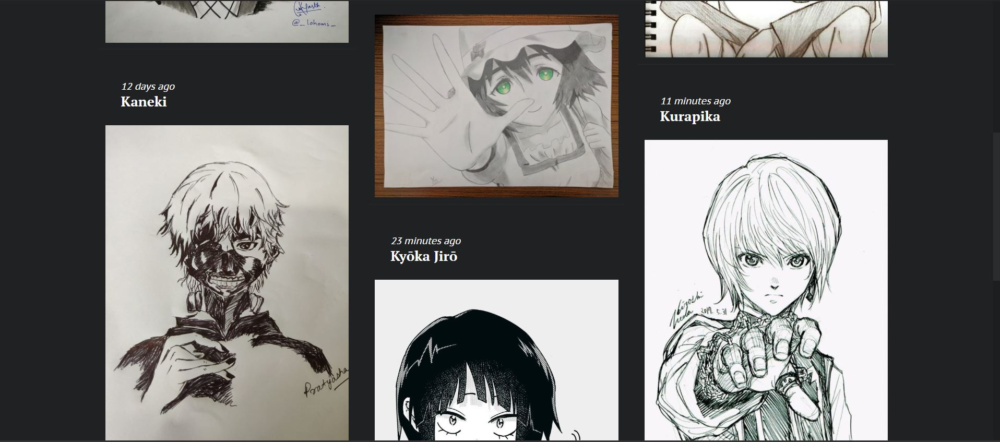
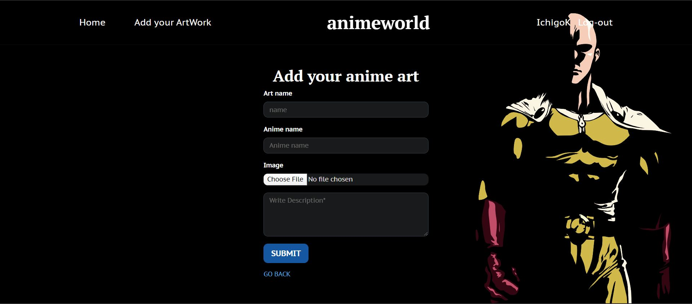

# animeWorld
A dynamic web-platform where users (mostly anime fans) can view, add, edit and delete their posts or arts i.e. implementing all CRUD operations.
Built using NodeJS, ExpressJS, MongoDB and VanillaJS.

HOME PAGE (It is a slideshow of images)

MAIN PAGE 

Additional to these pages there is a login , registration pages.

